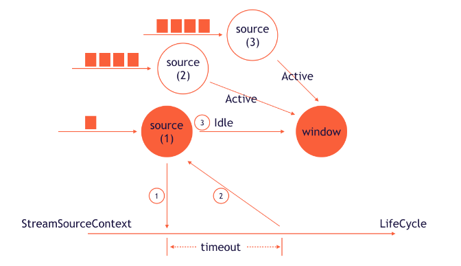

## Flink的时间和窗口

#### 时间语义

流式应用采用两个不同概念的时间, 处理时间和事件时间

处理时间(processing time) : flink机器节点上的时间. (重视速度,低延迟)

事件时间(event time): 数据流事件实际发生的时间,即使发送有延迟,亦能保证数据乱序结果正确.(结果正确,允许处理延迟,无序数据)

时间戳: 在事件时间模式下所有的记录都会包含时间戳, 在算子计算中会根据时间戳触发计算.

水位线(watermark): 要等多久才能收到所有特定时间范围的之前的事件? 如何得知数据会产生延迟?

没有完美的答案, 但是可以依靠水位线,来设定事件时间的窗口行为.算子接收到水位线,代表某个特定时间区间的数据已经收集完毕.

水位线基本属性: 

	1. 单调递增, 为了确保任务中的事件时间时钟正确前进
	2. 与时间戳保持联系. 当水位线为T, 代表接下来的时间戳一定都大于T.

算子对水位线的处理方式:

```
1. 基于水位线记录的时间戳更新内部事件时间时钟
2. 任务的时间服务会找到所有触发时间小于更新后事件时间的计时器.对于每个到期的计时器,调用回调函数计算.
3. 任务根据更新后的事件时间将水位线发出去.
```

 案例分析:



```
一个任务如何将水位线发送到多个输出任务,已经从多个输入任务获取水位线后如何推动事件时间时钟前进?
任务的每个输入分区,都会维护一个分区水位线(partition watermark) 分区水位线采用传递过来最大的值,
任务采用所有分区水位线中最小的值. 如上图三个分区水位线使用1,如果事件时间更新,任务先处理因此触发的所有计时器.
之后广播到下游分区.
但是生产中会有一些特殊情况,一条数据流长期没有数据(比如数据是波峰的,被上游过滤)那么水位线一直不会改变.
这种情况要引入ldle(设置timeout,多久没有接受数据后将这条数据流标记) 下游不再使用这条数据流的watermark.
另一种情况是数据倾斜,这条数据流的时间戳远低于其他数据流的时间戳.导致window存储大量的数据无法释放,导致oom.

```

时间戳分配和水位线生成:

```
1.数据源完成
2.周期分配期,AssignerWithPeriodicWatermarks用户自定义函数,从纪录里面提取时间戳,周期性响应水位线查询.
3.定点分配器,AssignerWithPunctuatedWatermarks同样支持从纪录里面提取时间戳.但不会是每一条记录.
4.以上分配器都已经过期了
```


### 关于自定义代码实现

```java
1.15 版本 :  assignTimestampsAndWatermarks(WatermarkStrategy<T> watermarkStrategy) 
WatermarkStrategy 接口
  createTimestampAssigner 时间戳(从数据提取字段的函数)
  	TimestampAssigner 接口
  createWatermarkGenerator watermark生成器
  	WatermarkGenerator 接口
      onEvent 每个事件数据调用一次
      onPeriodicEmit	周期性调用
    源码: 
      @Override
      public void onEvent(T event, long eventTimestamp, WatermarkOutput output) {
          maxTimestamp = Math.max(maxTimestamp, eventTimestamp);
      }

      @Override
      public void onPeriodicEmit(WatermarkOutput output) {
          output.emitWatermark(new Watermark(maxTimestamp - outOfOrdernessMillis - 1));
      }
```

### flink 内置watermark生成器

```java
单调递增时间戳分配器
      static <T> WatermarkStrategy<T> forMonotonousTimestamps() {
        return (ctx) -> new AscendingTimestampsWatermarks<>();
    }
存在最大固定延迟的时间戳分配器
      static <T> WatermarkStrategy<T> forBoundedOutOfOrderness(Duration maxOutOfOrderness) {
        return (ctx) -> new BoundedOutOfOrdernessWatermarks<>(maxOutOfOrderness);
    }

```


