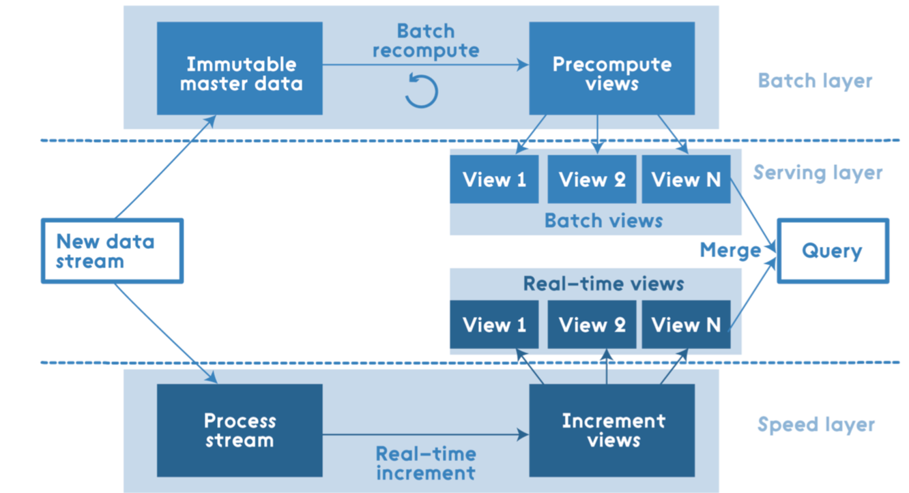

## Flink 概要说明

### 数据处理的类型

> OLTP 事务型处理.
>
> 订单, 网址点击,邮件, 一个或者多个应用共享同一个数据库系统,在线调用数据库事务读取或者更新状态.
>
> 这种模式常见于单体应用, 后来基于成本,业务场景变化,演化出了微服务架构.
>
> OLAP 分析型处理
>
> 订单获取增长率, 物流配送预测库存调整, 分析型查询通常不会在事务性的数据库进行操作,而是选择
>
> 通过提取-转换-加载(Extract-Transform-Load ETL) 加载到数据仓库.
>
> 状态流处理 
>
> flink会将应用的状态存储到本地内存或者嵌入式数据库. 由于采用分布式的架构,flink定期checkpoint写入远程
>
> 持久化存储. 流状态的应用通常和事件日志系统合作(Kafka), Kafka保证持久化的输入事件,并且以确定的顺序进行
>
> 重放, flink可以利用检查点恢复状态并且重置Kafka的读取位置

### 流处理应用细分

> 事件驱动应用 
>
> 场景: 实时推荐,模式识别或复杂事件处理, 异常检测
>
> 数据管道应用
>
> 为了提升访问的效率,一个产品可能放到多个数据存储系统(es,redis,mysql...)
>
> 传统方案同步数据是定期进行etl的数据执行,时效性太差.
>
> 新思路是通过事件日志系统分发更新,flink处理数据转化和多种不同数据源的数据处理
>
> 流式处理
>
> 网络监控,用户行为分析

### 引擎架构演进

```java
第一版分布式流处理引擎2011年, API较为底层,没有针对准确性一致性进行保证,牺牲了准确性换来了低延迟.
lambda架构, 分为批处理, 流处理两个部分,流处理实时模拟近似结果,批处理得到精准结果,最终结果是2者的合并.
```



```java
第二版引擎2013年,提供了高级的API,保证记录不会多次参与计算(处理延迟从毫秒级到秒级),但是结果任然依赖于事件到来的时间和顺序.
第三部引擎2015年, 解除事件顺序的依赖,实现批流统一,性能大幅提升. lambda架构慢慢弃用.

```

