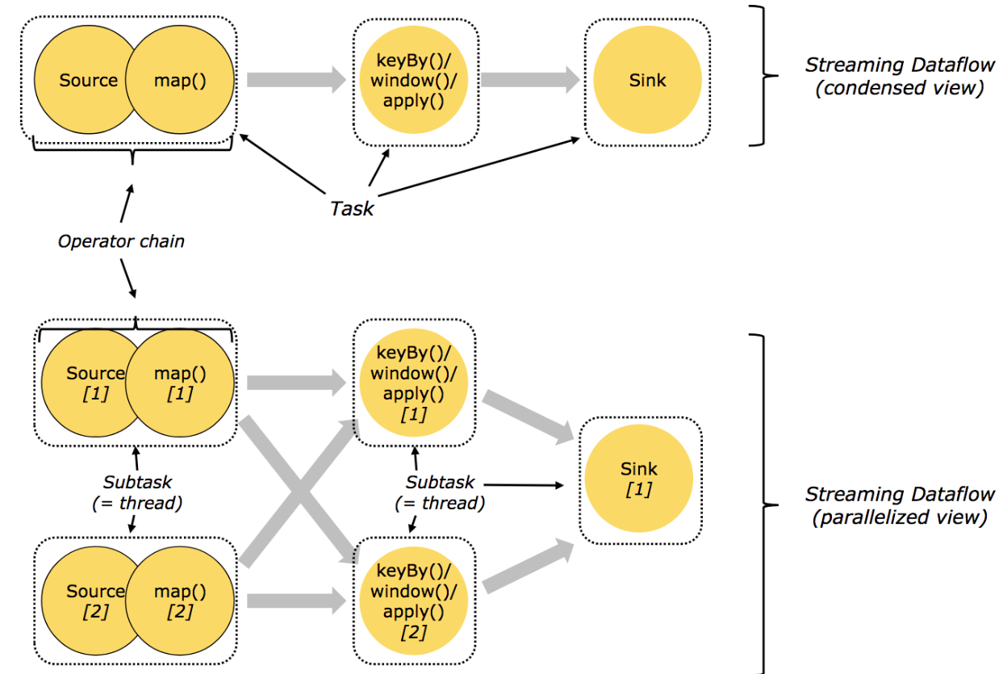

## 流处理基础

### Dataflow

dataflow 被称为逻辑图, 顶点就是算子, 在物理图顶点代表不同机器的任务.

dataflow的并行操作分为数据并行 (如上图抽取数据的souce 算子分为2个任务进行数据的读取),

任务并行(上图中三部分任务都是在同时运行,而非串行等待)

### 运行架构 

**程序**  ->  **Dispatcher** ->  **dataflow** -> **jobmaster** -> **resourcemanger** -> **taskmanager** -> **task slot** 

jobManager 一个job的核心

resoucemanger 一个集群只有一个, 控制CPU ,内存,网络等资源

taskmanager 

task slot任务执行的最新单位

Dispacher 提交任务生成jobmaster

-- TODO 1.15 官方文档